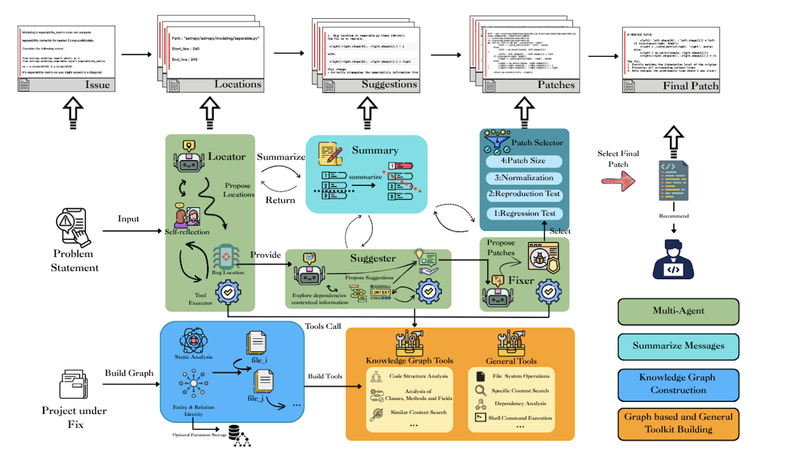

# SGAgent



SGAgent is an intelligent software engineering agent designed to automatically locate, analyze, and fix issues in GitHub repositories. It uses advanced AI techniques combined with code knowledge graphs to understand complex codebases and generate precise fixes for reported issues.

## Project Structure

```
sgagent/
- agent/                 # Core agent implementation
- cases/                 # Test cases and reproduction data
- dataset/               # Project datasets in parquet format
- kg/                    # Knowledge graph construction and utilities
- logs/                  # Execution logs and results
- models/                # Data models and entities
- prompts/               # LLM prompts for different agents
- retriever/             # Code knowledge graph retriever
- router/                # Workflow routing logic
- script/                # Utility scripts for various operations
- static/                # Static assets and images
- tools/                 # Tool implementations for agent usage
- utils/                 # Utility functions and helpers
- workflow/              # Workflow graph and state management
- main.py                # Main entry point
- settings.py            # Configuration settings
- pending.txt            # Target dataset instance IDs
- pyproject.toml         # Project dependencies and metadata
```

## Directory Details

### agent/
Contains the core implementation of the SGAgent agents:
- `core.py`: Main agent functionality including state management and node execution
- `state.py`: Agent state definitions using Pydantic models

### cases/
Contains test cases and reproduction data for issue fixing:
- `reproduction_lite.jsonl`: Lightweight test cases
- `reproduction_verified.jsonl`: Verified test cases

### dataset/
Contains project datasets in Apache Parquet format:
- `lite.parquet`: Lightweight dataset for quick testing
- `verified.parquet`: Verified dataset with confirmed issue cases

### kg/
Knowledge Graph implementation for code understanding:
- `construct_tags.py`: Builds code structure tags and relationships
- `main.py`: Main knowledge graph construction interface
- `utils.py`: Utility functions for knowledge graph operations

### logs/
Execution logs and results storage:
- Contains timestamped logs for each execution
- Stores API call statistics and patch results

### models/
Data models and entities used throughout the system:
- `entities.py`: Core data structures for code elements

### pending.txt
Contains the instance IDs of the target dataset that the SGAgent agent will process. Each line represents a unique identifier for an issue instance that needs to be analyzed and fixed.

### prompts/
LLM prompts for different agents in the workflow:
- `system.py`: System prompts with tool definitions
- `locator.py`: Prompts for the issue location agent
- `suggester.py`: Prompts for the fix suggestion agent
- `fixer.py`: Prompts for the code fixing agent

### settings.py
Configuration file that defines all the settings used by the SGAgent agent:
- LLM API settings (API keys, base URLs, model names)
- Neo4j database connection settings
- Project-specific settings (TEST_BED, PROJECT_NAME, INSTANCE_ID, PROBLEM_STATEMENT)
- Execution round identifier
- Unified timestamp for the application run

The settings can be configured through environment variables or directly in this file.

### retriever/
Code Knowledge Graph Retriever for intelligent code search:
- `ckg_retriever.py`: Main retriever implementation with relationship analysis
- `converters.py`: Data conversion utilities

### router/
Workflow routing logic:
- `router.py`: Conditional routing functions for agent transitions

### script/
Utility scripts for various operations:
- `apply_patch.py`: Patch application utilities
- `evaluation/`: Evaluation scripts and metrics
- `find_err.py`: Error finding utilities
- `replace.py`: Code replacement utilities
- `rerank.py`: Result reranking algorithms
- `reset.py`: Project reset utilities

### static/
Static assets and images:
- Documentation images and visual assets

### tools/
Tool implementations that wrap retriever methods for agent usage:
- `retriever_tools.py`: Tool functions that provide agent-accessible interfaces to the knowledge graph

### utils/
Utility functions and helpers:
- `decorators.py`: Custom decorators
- `logger.py`: Logging utilities
- `logging.py`: Advanced logging configuration
- `text_processing.py`: Text processing utilities

### workflow/
Workflow graph and state management:
- `graph.py`: LangGraph workflow construction
- `summarizer.py`: Conversation summarization for long executions

## Core Workflow

SGAgent follows a three-stage workflow:

1. **Locator**: Identifies suspicious code locations related to the issue
2. **Suggester**: Analyzes the located code and provides fix suggestions
3. **Fixer**: Implements the actual code fixes based on suggestions

## Key Features

- **Knowledge Graph-Based Code Understanding**: Uses a constructed knowledge graph to understand code relationships and dependencies
- **Multi-Agent Architecture**: Employs specialized agents for different stages of issue fixing
- **Precise Patch Generation**: Generates minimal, context-aware code patches
- **Framework Compatibility**: Maintains compatibility with existing project structures and patterns
- **Extensive Tooling**: Provides a rich set of tools for code analysis and manipulation

## Requirements

- Python 3.12+
- Dependencies listed in `pyproject.toml`

## Usage

To run SGAgent on a GitHub repository:

1: install uv 


```bash
uv run run_batch.py
or
uv run main.py
```

Configuration is handled through environment variables and the `settings.py` file.